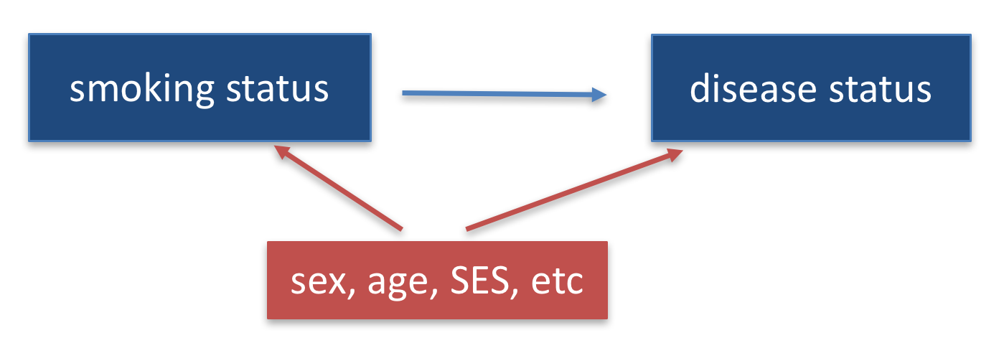
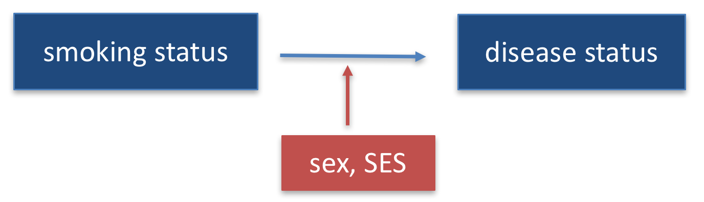

```{r setup, include=FALSE}
knitr::opts_chunk$set(echo = TRUE, message = FALSE)
knitr::opts_knit$set(root.dir = "/cloud/project")
```

## Preliminaries

Again, first we load the packages that we will be using in this document.  It's good practices to load packages as the beginning so they are all in the same place.  If you decide later you need an additional package, add it to the top of the document!
```{r}
library(tidyverse)  # core group of tidyverse packages
library(kableExtra)  # to make nice tables
library(broom)   # for tidy model output
```

## Module 1: Smoking and the risk of disease

Questions of interest:

* **Question 1.1: ** How does the risk of disease compare for smokers and otherwise similar non-smokers?

<center>
{width=500px}
</center>

* **Queston 1.2: ** Does the contribution of smoking to the risk of disease vary by sex or socio-economic status (SES)?

<center>
{width=500px}
</center>

To address each question we want:

* A data display (graph or table)
* A statistical analysis (with interprepration)

We will answer these questions using data from the National Medical Expenditures Survey (NMES)

## Discussion of NMES logistic regression results for Question 1-1

In your breakout groups, take 20-25 minutes to discuss the following sets of logistic regression results and interpretations.  Looking at all 8 sets of results/interpretations, answer the following questions:

(1) In order to address the comparison of interest between smokers and non-smokers, which variable **must** be included in the model?

(2) In order to allow for comparison between smokers and **otherwise similar** non-smokers, what must be included in the model?  What must be included in the interpretation?

(3) To address our question of interest, should we interpret **all** the coefficients in the regression model?  Or just some of them?

(4) To address our question of interest, is it better to present/interpret the regression coefficients or the odds ratios?

(5) To address our question of interest, how can we include information about the significance of the relationship of interest in our interpretation?

(6) If you were to create a nice succinct table of results to communicate the relevant information from the R output to the reader, what pieces of information would you include? What could be excluded?  What aesthetic choices would you make when presenting the information in the table and in the text?

(7) For a variable like age, should we include it in our regression model in its continuous form (see Results 2 and 8) or in a categorical form (see Results 1, 5, and 6)?  Why?

(8) Should the variables used to determine "otherwise similar" in the regression model match the variables used to determine "otherwise similar" in the data display (graph)?  Why or why not?

(9) We would like you to be **numerate** in your interpretations of your analysis results.  What do we mean by numerate and which interpretations below do a good job of being numerate?

(10) Are there any interpretations or results shown below that you think are technically incorrect? Are there some that you particularly like? Which ones sound the most like something you think you would read in a scientific publication?


### Results 1

$$\log(odds \ of \ MCSD) = \beta_0 + \beta_1 \cdot (eversmk) + \beta_2 \cdot educate + \beta_3 \cdot female$$
The coefficients in the logistic regression are interpreted as if the other variables are bieng held constant. 

* For every one unit change in the smoking status of an individual (either 0 or 1), the odds of MSCD increase by 1.745, as indicated by, $\beta_1=\ 1.745$, **holding education status and gender (female or male) constant**. The confidence interval for $\beta_1$ is (1.35, 2.27), which does not contain the null value, 1, therefore meaning that we can reject the null hypothesis that there is no change in the odds of MSCD when the smoking status of an individual changes. 

* For every one unit change in the education status of an individual (1=college graduate, 2=some college, 3=HS grad, 4=other), the odds of MSCD increase by 1.413, as indicated by, $\beta_2=\ 1.413$, **holding smoking status and gender (female or male) constant**. The confidence interval for $\beta_2$ is (1.22, 1.64), which does not contain the null value, 1, therefore meaning that we can reject the null hypothesis that there is no change in the odds of MSCD when the education status of an individual changes. 


* For every one unit change in the gender (1=female, 0=male) of an individual (1=college graduate, 2=some college, 3=HS grad, 4=other), the odds of MSCD increase by 1.469, as indicated by, $\beta_3=\ 1.469$, **holding smoking status and education status constant**. The confidence interval for $\beta_3$ is (1.14, 1.89), which does not contain the null value, 1, therefore meaning that we can reject the null hypothesis that there is no change in the odds of MSCD when the gender of an individual changes. 

```{r echo = FALSE}
nmes_data <- read_csv("module_1/nmesUNPROC.csv")

nmes_data1 <- nmes_data %>%
  mutate(
    eversmk = factor(eversmk, levels = c("0", "1"), labels = c("Never Smoked", "Ever Smoked")),
    lc5 = factor(lc5, levels = c("0", "1"), labels = c("No LC", "LC")),
    female = factor(female, levels = c("1", "0"), labels = c("female", "male")),
    beltuse = factor(beltuse, levels = c("1", "2", "3"), labels = c("rare", "sometimes", "always")), 
     chd5 = factor(chd5, levels = c("0", "1"), labels = c("No CHD5", "CHD5")),
    disease = factor(lc5 == "LC" | chd5 == "CHD5", 
                          levels=c(FALSE, TRUE), 
                          labels=c("No disease", "Disease"))
  )


#log regression with some confounders
model3 <- glm(disease ~ eversmk + educate + female, family=binomial(link="logit"), data=nmes_data1)

model3 %>%
  tidy(exponentiate = TRUE, conf.int = TRUE, conf.level = 0.95) %>%
  filter(term != "(Intercept)") %>%
  mutate(conf.int = paste0("(", round(conf.low, 2), ", ", round(conf.high,2), ")")) %>%
  select(Term = term, OR = estimate, `p-value` = p.value, `95% CI` = conf.int) %>%
  kable(digits = 3, format = "markdown")
```


### Results 2

**The model suggests that smoking, older age, poverty being a male are more likely to have MSCD as they show significant association. BMI, education level, and marital status showed non-significant association and the model has a significant reduction in residual deviance as compared to the null model and is therefore a good fit.**

```{r echo = FALSE}
nmes_data<- read_csv("module_1/nmesUNPROC.csv")

nmes_data <- nmes_data %>%
  mutate(mscd = (lc5 == 1) | (chd5 == 1))%>%
  mutate(mscd_recode = factor(mscd)) %>%
  mutate(mscd_recode = fct_recode(mscd_recode,
    "Yes" = "TRUE",
    "No" = "FALSE"))%>%
  mutate(mscd = mscd_recode) %>%

  mutate(eversmk_recoded = fct_recode(factor(eversmk),
                                         "Ever smoker" = "1",
                                         "Never smoker" = "0",)) %>%
  mutate(eversmk = eversmk_recoded) %>%
  select(-eversmk_recoded)%>%

  mutate(female_recoded = fct_recode(factor(female),
                                         "Female" = "1",
                                         "Male" = "0")) %>%
  mutate(female = female_recoded) %>%
  select(-female_recoded) 

 nmes_data <- nmes_data %>% 
  mutate(poor_recoded = factor(poor, labels = c("Not Poor", "Poor")))
```

```{r}
model <- glm(mscd ~ eversmk + age + bmi + female + poor + educate + marital, data=nmes_data, family = binomial)
summary(model)
tidy_table <- broom::tidy(model)
kable(tidy_table, 
      col.names = c("Term", "Estimate", "Std. Error", "Statistic", "P-value"),
      caption = "Tidy Logistic Regression Results for MSCD",
      align = "c") %>%
  kable_styling(full_width = FALSE, position = "center") %>%
  row_spec(0, bold = TRUE)
print(tidy_table)
```

### Results 3


**From the table, it appears that smoking status, sex, and SES are all significantly correlated with increased odds of having an MSCD, as the p-values are all less than 0.05, the confidence intervals do not contain 0. It seems like being poor puts you at more risk of getting MSCD, with the highest OR (5.1).**


```{r echo = FALSE}
nmes_data <- read_csv("module_1/nmesUNPROC.csv")

nmes_data <- nmes_data %>%
  mutate(mscd = (lc5 == 1) | (chd5 == 1))%>%
  mutate(mscd_recode = factor(mscd)) %>%
  mutate(mscd_recode = fct_recode(mscd_recode,
    "Yes" = "TRUE",
    "No" = "FALSE"))%>%
  mutate(mscd = mscd_recode) %>%

  mutate(eversmk = factor(eversmk, levels = c("0", "1"), labels = c("Never smoked", "Smoked")), 
         poor = factor(poor, levels = c("0", "1"), labels = c("Not poor", "poor")),
         female = factor(female, levels = c("0", "1"), labels = c("Male", "Female"))
         )
```

```{r}
# code for logistic regression
my_model <- glm(mscd~eversmk + female + poor, family=binomial(link="logit"), data=nmes_data)

my_model %>%
  tidy(exponentiate = TRUE, conf.int = TRUE, conf.level = 0.95) %>%
  mutate(conf.int = paste0("(", round(conf.low, 2), ", ", round(conf.high,2), ")")) %>%
  select(Term = term, OR = estimate, `p-value` = p.value, `95% CI` = conf.int) %>%
  kable(digits = 3, format = "markdown")
  
```

### Results 4

**Being an Ever Smoker is associated with a 220% higher chance of being afflicted with an MSCD. A one-year increase in age is associated with a nearly 8% higher chance of being afflicted with an MSCD. Being a female is associated with a 26% lower chance of having an MSCD.**

```{r echo = FALSE}
nmes_data <- read_csv("module_1/nmesUNPROC.csv")

## Recode 1 and 0 to yes and no
nmes_data <- nmes_data %>%
  mutate(eversmk = factor(eversmk, levels = c("0", "1"), labels = c("Never smoker", "Ever smoker")),
         lc5 = factor(lc5, levels = c("0", "1"), labels = c("No LC", "LC")),
         chd5 = factor(chd5, levels = c("0", "1"), labels = c("No CHD", "CHD")),
         female = factor(female, levels = c("0", "1"), labels = c("Male", "Female")),
         poor = factor(poor, levels = c("0", "1"), labels = c("Not Poor", "Poor")))


## Create mscd variable for LC *OR* CHD
nmes_data <- nmes_data %>%
  mutate(mscd = (lc5 == "LC") | (chd5 == "CHD"))%>%
  mutate(mscd_recode = factor(mscd)) %>%
  mutate(mscd_recode = fct_recode(mscd_recode,
    "Yes" = "TRUE",
    "No" = "FALSE"))%>%
  mutate(mscd = mscd_recode)

nmes_data <- nmes_data %>% 
  mutate(age_cat = cut(age,
                      breaks = c(0,30,45,60,75,100),
                      labels = c("Age < 30", "Age 30-45", "Age 45-60", "Age 60-75", "Age > 75")))


nmes_data <- nmes_data %>%
  group_by(age, eversmk, female) %>%
  mutate(prop_MSCD = sum(mscd == "Yes") / n())


```

```{r}
MSCDmodel <- glm(mscd ~ eversmk + age + female, family=binomial(link="logit"), data=nmes_data)

summary(MSCDmodel)

tidy(MSCDmodel)

MSCDmodel %>%
  tidy(exponentiate = TRUE, conf.int = TRUE, conf.level = 0.96) %>%
  filter(term != "(Intercept)") %>%
  mutate(conf.int = paste0("(", round(conf.low, 2), ", ", round(conf.high,2), ")")) %>%
  select(Term = term, OR = estimate, `p-value` = p.value, `95% CI` = conf.int) %>%
  kable(digits = 3, format = "markdown")
```

### Results 5

**The odds of developing a major smoking-caused disease (MSCD) is 1.88 times greater in individuals who have smoked compared to individuals who have never smoked. This value is significant. Additionally, the odds of individuals developing an MSCD is 4.84 times greater in poorer individuals. However, education level does not have a significant affect in developing an MSCD.**

```{r echo = FALSE}
nmes_data <- read_csv("module_1/nmesUNPROC.csv")

revised_reg <- nmes_data %>%
  mutate(disease = factor(lc5 == "1" | chd5 == "1", 
                          levels=c(FALSE, TRUE), 
                          labels=c("0", "1")))

model2 <- glm(disease ~ eversmk + poor + educate, family=binomial(link="logit"), data=revised_reg)
summary(model2)

model2 %>%
   tidy(exponentiate = TRUE, conf.int = TRUE, conf.level = 0.95) %>%
  filter(term != "(Intercept)") %>%
  mutate(conf.int = paste0("(", round(conf.low, 2), ", ", round(conf.high,2), ")")) %>%
  select(Term = term, OR = estimate, `p-value` = p.value, `95% CI` = conf.int) %>%
  kable(digits = 3, format = "markdown")
```


### Results 6

***The odds of receiving a major smoking-caused disease is 2.451 times greater in people who have smoked compared to people who have never smoked. ***

***As well, the odds of receiving a major smoking-caused disease is 2.454 times greater in people who identify as poor compared to people who identify as not poor. ***

***Lastly, a participant one year older compared to another participant has a 6.8% greater odds of receiving an MSCD. ***

***All three of these variables are statistically significant according to our regression model, as none of their P-values are greater than 0.05, allowing us to reject the null hypothesis and say that these variables do in fact change the odds of receiving a major smoking-caused disease compared to the baseline of a not-poor, non-smoking individual at age 0. This regression model can be improved by adding a minimum age to the age variable later. ***

```{r echo = FALSE}
nmes_data <- read_csv("module_1/nmesUNPROC.csv")

nmes_data <- nmes_data %>%
  mutate(eversmk = factor(eversmk, levels = c("0", "1"), labels = c("Never Smoked", "Has Smoked")),
         lc5 = factor(lc5, levels = c("0", "1"), labels = c("No LC", "LC")),
         educate = factor(educate, levels = c("1","2","3","4"), labels = c("College Grad", "some college", "HS Grad", "other")),
         poor = factor(poor, levels = c("0", "1"), labels = c("not poor", "poor")),
         chd5 = factor(chd5, levels = c("0", "1"), labels = c("No CHD", "CHD"))
         )
nmes_data <- nmes_data %>%
  mutate(disease = factor(lc5 == "LC" | chd5 == "CHD", 
                          levels=c(FALSE, TRUE), 
                          labels=c("No disease", "Disease")))
nmes_data <- nmes_data %>% 
  mutate(age_cat = case_when(
    age > 0 & age < 30 ~ "Age < 30",
    age >= 30 & age <=60 ~ "Age 30-60",
    age > 60 ~ "Age > 60"
  ) %>% factor(levels = c("Age < 30", "Age 30-60", "Age > 60")))


my_table <- nmes_data %>%
    count(poor, age_cat, eversmk, disease) %>%
    mutate(prop = n/sum(n))
my_table %>%
  filter(disease == "Disease") %>%
  ggplot() + 
  geom_bar(aes(x = eversmk, y = prop, fill = disease), stat = "identity", position = "stack") +
  facet_grid(poor~age_cat) + 
  ylab('Proportion') + xlab('Smoking Status') +
  ggtitle("Risk of Major Smoking Caused Disease (MSCD) based on Smoking Status", subtitle = "Stratified by Age Categories and Poverty Status")+
   scale_fill_manual(values=c('#E69F00'))+
   theme_minimal() +
  theme(legend.position = "right", axis.text.x = element_text(angle = 45, vjust = 1, hjust = 1)) + guides(fill = FALSE)
```

```{r}
regression <- glm(disease ~ eversmk + poor + age, family=binomial(link="logit"), data=nmes_data)
regression %>%
  tidy(exponentiate = TRUE, conf.int = TRUE, conf.level = 0.96) %>%
  filter(term != "(Intercept)") %>%
  mutate(conf.int = paste0("(", round(conf.low, 2), ", ", round(conf.high,2), ")")) %>%
  select(Term = term, OR = estimate, `p-value` = p.value, `95% CI` = conf.int) %>%
  kable(digits = 3, format = "markdown")
```


### Results 7

**Based on my logistic model, we can tell that people who smoke have a 1.709x higher chance of developing a MSCD compared to non-smokers. For those who are poor we see a much higher chance, as they have a 5.109x higher chance of developing a MSCD compared to non poor. Lastly, we see that for females, there is a 0.665x chance of developing a MSCD compared to males. This being said, we see higher chances calculated for those who are poor, male, or a smoker as expected by the graph generated.**

```{r echo = FALSE}
nmes_data <- read_csv("module_1/nmesUNPROC.csv")

nmes_data <- nmes_data%>%
  mutate(lc5 = factor(lc5, levels=c("0","1"), labels=c("No LC", "LC")),
         chd5=factor(chd5, levels=c("0","1"), labels=c("No CHD", "CHD")),
         eversmk = factor(eversmk, levels = c("0", "1"), labels = c("N", "Y")),
         female = factor (female, levels = c("0","1"), labels = c("Male","Female")),
         poor = factor(poor, levels = c("0","1"), labels = c("Not Poor","Poor")),
  )

### Creates a column called "disease" by combining the lc5 and chd5 columns in the original dataset 
nmes_data <- nmes_data%>%
  mutate(disease = (lc5 =="LC"|chd5 == "CHD"))

### Recodes the disease values to have more meaningful labels
nmes_data <- nmes_data%>% 
  mutate(disease = factor(disease, levels = c("FALSE", "TRUE"), labels=c("No Disease", "Disease")))


nmes_table <- nmes_data %>%
  count(eversmk,disease,female, poor)%>%
  group_by(eversmk,female, poor)%>%
  mutate(percent=n/sum(n)*100)

### Plots the graph
nmes_table %>%
  filter (disease == "Disease")%>%
  ggplot()+ 
  geom_bar(aes(x = eversmk, y = percent, fill=disease), fill = "lightblue", stat="identity")+
  facet_grid(female~poor)+
  theme_bw(base_size=8.5)+
  geom_text(aes(x=eversmk, y= percent, label=round(percent, digits=2), vjust=1.5))+
  labs(y = "Risk of Major Smoking Caused Diseases (%)",
       x = "Ever Smoked",
       title = "Risk of Major Smoking Caused Diseases (MSCD), Comparing Smokers to Non-Smokers",
       subtitle = "N = Never Smoked, Y = Ever Smoked")+
  theme(legend.position = "none",
        plot.title = element_text(hjust = 0.5),
        plot.subtitle = element_text(hjust = 0.5))

```

```{r}
model <- glm(disease ~ eversmk + female + poor, family=binomial(link="logit"), data=nmes_data)

summary(model) 
tidy(model) 

model%>%
  tidy(exponentiate = TRUE, conf.int = TRUE, conf.level = 0.95) %>% 
  filter(term != "(Intercept)") %>% 
  mutate(conf.int = paste0("(", round(conf.low, 2), ", ", round(conf.high,2), ")")) %>%        select(Term = term, OR = estimate, `p-value` = p.value, `95% CI` = conf.int) %>% 
  kable(digits = 3, format = "markdown")
```

### Results 8

**The logistical regression I made shows that both variables are statistically significant in their confounding of the relationship between smoking and MSCD. Being poor has the highest odds ratio of 5.109. This indicates that being poor, while holding smoking status and sex constant, leads to a 5.109 greater chance of having MSCD than not being poor. **

```{r echo = FALSE}
nmes_data <- read_csv("module_1/nmesUNPROC.csv")

nmes_data <- nmes_data %>%
   mutate(smoker = factor(eversmk, levels = c("0", "1"), labels = c("Never smoker", "Smoker")),
        female = factor(female, levels = c("0", "1"), labels = c("Male", "Female")),
        poor = factor(poor, levels = c("0", "1"), labels = c("Not Poor", "Poor")),
        MSCD = factor(lc5 == 0 & chd5 == 0, levels = c(TRUE,FALSE), labels = c("No MSCD", "MSCD")) 
          )


my_table_MSCD <- nmes_data %>%
  count(MSCD, smoker, poor,female) %>%
  group_by(smoker, poor,female) %>%
  mutate(nnew = sum(n))%>%
  mutate(prop = n/sum(n))


##creating graphs 

my_table_MSCD%>%
  filter(MSCD=="MSCD")%>%
  ggplot()+
  geom_bar(aes(x = smoker, y = prop), stat = "identity", fill = 'black' ) + facet_grid(female~poor) +
  labs(y= "Risk of MSCD", x= "Smoking Status", title = "Risk of MSCD by Smoking Status", subtitle = "Stratified by Sex and Poverty Status") +
  theme(plot.title = element_text(hjust = 0.5),
        plot.subtitle = element_text(hjust = 0.5))+
  geom_text(aes(x = smoker, y = prop,label = paste(n,'of',nnew)),colour = 'green', vjust = 1.3) 

```

```{r}
model1 <- glm(MSCD ~ smoker + female + poor, family=binomial(link="logit"), data=nmes_data)


model1 %>%
  tidy(exponentiate = TRUE, conf.int = TRUE, conf.level = 0.95) %>%
  filter(term != "(Intercept)") %>%
  mutate(conf.int = paste0("(", round(conf.low, 2), ", ", round(conf.high,2), ")")) %>%
  select(Variable = term, `Odds Ratio` = estimate, `p-value` = p.value, `95% CI` = conf.int) %>%
  kable(digits = 3 , format = "markdown")

```


## R notes based Assignment 1-2

We're including some notes here on aesthetics for improving your tables/displays as we start to work to a final project report.  You should also feel free to ask questions on Piazza if there is something you would like us to help you learn how to do!

### Recoding the data
```{r}
nmes_data <- read_csv("module_1/nmesUNPROC.csv")

nmes_data <- nmes_data %>%
  mutate(eversmk = factor(eversmk, levels = c("0", "1"), labels = c("Never smoker", "Ever smoker")),
         lc5 = factor(lc5, levels = c("0", "1"), labels = c("No LC", "LC")),
         chd5 = factor(chd5, levels = c("0", "1"), labels = c("No CHD", "CHD")),
         female = factor(female, levels= c("0", "1"), labels = c("Male", "Female")),
         current = factor(current, levels= c("0", "1"), labels = c("Not current smoker", "Current smoker")),
         former = factor(former, levels= c("0", "1"), labels = c("Not former smoker", "Former smoker")),
         beltuse = factor(beltuse, levels= c("1", "2", "3"), labels = c("Rare", "Some", "Almost always")),
         educate = factor(educate, levels= c("1", "2", "3", "4"), labels = c("College grad", "Some college", "HS grad", "Other")),
         marital = factor(marital, levels= c("1", "2", "3", "4", "5"), labels = c("Married", "Widowed", "Divorced", "Separated", "Never married")),
         poor = factor(poor, levels= c("0", "1"), labels = c("Not poor", "Poor"))
         )

nmes_data <- nmes_data %>%
  mutate(disease = factor(lc5 == "LC" | chd5 == "CHD", 
                          levels=c(FALSE,TRUE), 
                          labels=c("No MSCD", "MSCD")))
```

### Using knitr/kableExtra and the pander package for tables

We already talked about using the `kable()` function (from the `knitr` package) to make your tables look nicer:

Original:
```{r}
nmes_data %>%
  count(disease)
```

Nicer:
```{r}
nmes_data %>%
  count(disease) %>%
  kable(format = "pipe")
```

You can also add a caption to a table directly with the `kable()` function:
```{r}
nmes_data %>%
  count(disease) %>%
  kable(format = "pipe",
        caption = "Table 1: Number of individuals with and without Major smoking-caused disease")
```

And you can change the number of decimals displayed in the table pretty easily as well.  Generally displaying only 3 significant figures in your tables is a good idea when you have values that include decimals.
```{r}
nmes_data %>%
  count(eversmk, disease) %>%
  group_by(eversmk) %>%
  mutate(prop = n/sum(n)) %>%
  filter(disease == "MSCD") %>%
  kable(format = "pipe",
        caption = "Table 2: Proportions of individuals with and without a MSCD by smoking status",
        digits=3)
```

You can find lots of information about fine-tuning tables using `kable()` and the `kableExtra` package [here](https://bookdown.org/yihui/rmarkdown-cookbook/tables.html).

There is also another package called `pander` which makes nice tables. You can install `pander` by running `install.packages("pander")`.  It works very similarly to `kable()` and you can find more information on how to modify settings [here](http://rapporter.github.io/pander/).

```{r}
library(pander)  # usually you would want to put this at the top of your document
nmes_data %>%
  count(eversmk, disease) %>%
  group_by(eversmk) %>%
  mutate(prop = n/sum(n)) %>%
  filter(disease == "MSCD") %>%
  pander(caption = "Table 2: Proportions of individuals with and without a MSCD by smoking status",
        digits=3)
```

To nicely display regression model output in a table, you can first store the results in a tidy format that can be manipulated like any other table/data in R. This is easy to do using the `tidy()` function from the `broom` package in R.  Remember, you'll have to use `install.packages("broom")` the first time you use it.

```{r}
library(broom)  # usually you would want to put this at the top of your document

my_model <- glm(disease ~ eversmk + age + female, family=binomial(link="logit"), data=nmes_data)
tidy(my_model)
```

In this tidy version of the model output, you see the results are arranged as a data set with variables names `term`, `estimate`, `std.error`, `statistic`, and `p.value`.  You can put this into a nicer table form using `kable()` or `pander()`, but can also easily change column names and add/remove columns and rows:
```{r}
my_model <- glm(disease ~ eversmk + age + female, family=binomial(link="logit"), data=nmes_data)
my_model_results <- tidy(my_model)

my_model_results %>%
  kable(format = "pipe",
        digits = 3)

my_model_results %>%
  mutate(odds.ratio = exp(estimate)) %>%  # add a column with the odds ratios
  filter(term != "(Intercept)") %>% # remove the row with the intercept
  select(Variable = term, `Odds Ratio` = odds.ratio, `p-value` = p.value ) %>% # select only the columns we want, rearrange columns, and change names
  kable(format = "pipe",
        digits = 3)
```

Some of these things can be done automatically with options in the `tidy()` function.  You can see more options using `?tidy.glm`.
```{r}
my_model_results <- tidy(my_model, 
                         exponentiate = TRUE,
                         conf.int = TRUE)

my_model_results

my_model_results %>%
  filter(term != "(Intercept)") %>% # remove the row with the intercept
  mutate(conf.int = paste0("(", round(conf.low, 2), ", ", round(conf.high, 2), ")")) %>% # combine the CI terms together into nice format 
  select(Variable = term, `Odds Ratio` = estimate, `p-value` = p.value, `95% Confidence Interval` = conf.int) %>% # select only the columns we want, rearrange columns, and change names
  kable(format = "pipe",
        digits = 3,
        align = c("l", "r", "r", "r"))
```

You can also change the variable names as well:
```{r}
my_model_results$term <- c("Intercept", "Ever smoker", "Age (years)", "Female")

my_model_results %>%
  filter(term != "Intercept") %>% # remove the row with the intercept
  mutate(conf.int = paste0("(", round(conf.low, 2), ", ", round(conf.high, 2), ")")) %>% # combine the CI terms together into nice format 
  select(Variable = term, `Odds Ratio` = estimate, `p-value` = p.value, `95% Confidence Interval` = conf.int) %>% # select only the columns we want, rearrange columns, and change names
  kable(format = "pipe",
        digits = 3,
        align = c("l", "r", "r", "r"))

```

### Making your report a little more readable

For your final assignment for this module, we will be asking you to write a report presenting your analysis with the answers to the questions posed. We want you to include all the code that you used for the analysis in the Rmd file, but not necessarily to print the output of the code to your html document. There are some very helpful tips for managing whether code and code output get printed to the screen to be found on the second page of this `rmarkdown` cheat sheet: https://rstudio.github.io/cheatsheets/html/rmarkdown.html

For example, if you want to create a table where you display the table, but not the code, you could put `echo=FALSE` in the top of the code chunk for that piece of code:
```{r , echo=FALSE}
my_model_results %>%
  filter(term != "Intercept") %>% # remove the row with the intercept
  mutate(conf.int = paste0("(", round(conf.low, 2), ", ", round(conf.high, 2), ")")) %>% # combine the CI terms together into nice format 
  select(Variable = term, `Odds Ratio` = estimate, `p-value` = p.value, `95% Confidence Interval` = conf.int) %>% # select only the columns we want, rearrange columns, and change names
  kable(format = "pipe",
        digits = 3,
        align = c("l", "r", "r", "r"),
        caption = "Table 1: Logistic regression results")

```

Similarly, if you have a code chunk that includes necessary code (that needs to run) but you don't want to see the code or the result of running that code, you can use `echo=FALSE` and `include=FALSE` in the top of the code chunk.
```{r , echo=FALSE, include=FALSE}
#Some important code that needs to run but we don't need to see or see the output!
```

There are some very helpful tips found here: http://kbroman.org/knitr_knutshell/pages/Rmarkdown.html

### Selecting colors for figures

If you want to control the colors you are using in your graphs, [this](https://www.r-graph-gallery.com/ggplot2-color.html) is a great detailed resource for seeing your options!

You can refer to a color in many different ways, but the easiest is by name.  You can see the complete list of 657 colors available in R by typing:
```{r eval=FALSE}
colors()
```

You can then assign the colors directly (if using only one color) or using the `scale_fill_manual()` function within your graph if you want different colors for different groups:
```{r}
plot_data <- nmes_data %>%
  count(eversmk, disease) %>%
  group_by(eversmk) %>%
  mutate(prop = n/sum(n)) %>%
  filter(disease == "MSCD")

ggplot(plot_data) +
  geom_bar(aes(x=eversmk, y=prop),
           stat="identity", fill = "deeppink")

ggplot(plot_data) +
  geom_bar(aes(x=eversmk, y=prop, fill = eversmk),
           stat="identity") +
  scale_fill_manual(values = c("deeppink", "chartreuse1"))
```

Sometimes it's better to leave color choices to the professionals, who know which colors look good together.  If you load the `RColorBrewer` package with `install.packages("RColorBrewer")`, you can select from within a predetermined color palatte.  You can see these color palettes [here](https://www.r-graph-gallery.com/38-rcolorbrewers-palettes.html).  You apply them in a similar way as your manual colors:

```{r}
library(RColorBrewer)
display.brewer.all() # to see all the colors

ggplot(plot_data) +
  geom_bar(aes(x=eversmk, y=prop, fill = eversmk),
           stat="identity") +
  scale_fill_brewer(palette = "Dark2")

```

### Adding labels to figure and changing themes

The cool thing about `ggplot2` is that everything just builds on top of what you've already accomplished, so if you want to change the background, you can just change the theme with one more short line of code. Here, we'll use `theme_bw()` to remove the default gray background. We'll then add an additional line of code to change the color of the bars using `scale_fill_manual()`. Finally, we will relabel the axes and title using `labs()`.

```{r}
# Change the appearance of the plot
ggplot(plot_data) +
  geom_bar(aes(x=eversmk, y=prop, fill=eversmk), stat="identity") +
  theme_bw() +
  scale_fill_brewer(palette = "Dark2") +
  labs(y="Risk of MSCD",
       x="",
       title="Risk of MSCD, comparing smokers to non-smokers")
```

One more important piece of controlling the look of your plot in ggplot2 uses `theme()`. You can control the look of your graphing using the *many* arguments of theme. Here, we'll introduce how to change the axis text size; however, if you type `?theme` below, you'll see all of the things that can be changed on your plots using `theme()`. For a good demonstration of themes, see https://github.com/jrnold/ggthemes.

```{r}
# Here, we'll start playing with font size
ggplot(plot_data) +
  geom_bar(aes(x=eversmk, y=prop, fill=eversmk), stat="identity") +
  theme_bw() +
  scale_fill_brewer(palette = "Dark2") +
  labs(y="Risk of MSCD",
       x="",
       title="Risk of MSCD, comparing smokers to non-smokers")+
  theme(axis.text=element_text(size=12))
```

Finally, here's a link to good resource about adding labels, text, scales, and themes to your graphics: https://r4ds.hadley.nz/communication.html


### Moving or removing legends  in a figure

Whenever you use an aesthetic like `color` or `fill` or `shape` in the `ggplot()` function, R will automatically create a legend to the right of the graph:
```{r}
my_table <- nmes_data %>%
  count(disease, eversmk) %>%
  group_by(eversmk) %>%
  mutate(prop = n/sum(n))

ggplot(data = my_table) + 
  geom_bar(aes(x = eversmk, y = prop, fill = disease), stat = "identity", position = "dodge")
```

You can change the name of this legend in the `labs()` function using the names of the aesthetic shown in the legend.  In this case, the legend shows the `fill` aesthetic, so we can rename it as follows:
```{r}
ggplot(data = my_table) + 
  geom_bar(aes(x = eversmk, y = prop, fill = disease), stat = "identity", position = "dodge") +
  labs(fill = "MSCD status")
```

We can also move the legend to a different location using the `legend.position` option within the `theme()` function:
```{r}
ggplot(data = my_table) + 
  geom_bar(aes(x = eversmk, y = prop, fill = disease), stat = "identity", position = "dodge") +
  labs(fill = "MSCD status") +
  theme(legend.position = "bottom")
```

Choices for the position can be `bottom`, `top`, `right`, `left`, or `none`.  The none option is especially useful when the legend doesn't add any useful information.  Consider the graph where we only show the risk of disease, not the risk of no disease:
```{r}
my_table <- nmes_data %>%
  count(disease, eversmk) %>%
  group_by(eversmk) %>%
  mutate(prop = n/sum(n)) %>%
  filter(disease == "MSCD")

ggplot(data = my_table) + 
  geom_bar(aes(x = eversmk, y = prop, fill = disease), stat = "identity", position = "dodge") +
  labs(fill = "MSCD status")
```

The legend on the side is not useful since there's only one color anyway!  So we can remove it:
```{r}
ggplot(data = my_table) + 
  geom_bar(aes(x = eversmk, y = prop, fill = disease), stat = "identity", position = "dodge") +
  labs(fill = "MSCD status") +
  theme(legend.position = "none")
```

### Removing missing values

You may have noticed that there are missing values of the BMI variable in this dataset.  We can see there are 124 missing values below: 
```{r}
nmes_data %>%
  count(is.na(bmi))
```

If you were planning to use the BMI variable in your analysis, you would need to do something to account for these missing values.  The topic of missing data could be an entire course of its own; there are many ways to handle the missing values and usually just removing the observations where there are missing values is not appropriate because it can introduce bias into our results.

However much of the topic is beyond the scope of this course.  In this case, only about 3% of the observations have missing BMI data (`124/(124+3954)) = 0.0304`), so we may choose to just exclude those participants.  

If you wanted to remove all participants with missing values of `bmi`, you could use the `drop_na()` function to do this:
```{r}
nmes_data_sub <- nmes_data %>%
  drop_na(bmi)

dim(nmes_data)
dim(nmes_data_sub)
nmes_data_sub %>% count(is.na(bmi))
```

I wouldn't suggest doing this unless you are planning to use BMI in your analysis, because if you do you will be excluding some data that could be used to answer your question of interest!


## Starting Assignment 1.3

Do the following to address Question 1.1: How does the risk of disease compare for smokers and otherwise similar non-smokers?

1. (**Can work on this now!**) Improve your data display, if needed. Interpret your data display to answer the question. That is, what does this display say about Question 1.1? *Be sure to focus on answering the question being asked!*

2. (**Can work on this now!**) Update your multivariable logistic regression model, if needed.  Interpret your coefficients and associated significance tests to answer the question.  That is, what does this model say about Question 1.1?  *Be sure to focus on answering the question being asked!*

3. (**Wait for Wednesday!**) Complete a propensity score analysis to answer the question:

    * Estimate propensity scores for the treatment of smoking (`eversmk`); that is, use logistic regression to estimate the probability of smoking given possible confounders.
    * Use logistic regression with quintiles of your propensity scores to answer Question 1.1.
    * Interpret the results -- both the relevant coefficient(s) and associated significance tests. *Be sure to focus on answering the question being asked!*
    
    
4. (**Wait for Wednesday!**) Compare the results of your multivariable logistic regression with your propensity score analysis.  Are them similar? Different?  Which analysis method do you prefer and why?

5. Submission notes:
    * Submit your assignment in R Markdown through Github by Sunday (February 11, 2024) at midnight. You can find a link to create this assignment in Github on Blackboard.
    * Post a **screenshot of your multivariable logistic regression results and your propensity score results**, on Piazza in the  "Assignment 1-3 Results" thread.  **Include your interpretations of what these two models say about Question 1.1 and any thoughts you have on which of these two analysis methods is preferred for answering Question 1.1.** 
    * On Piazza, you are welcome to post anonymously to your classmates. You can also include comments about what your chose to do or questions you had as you were making the display and fitting your model.
    * You may work together on this assignment, but you must submit your own assignment; please credit in your assignment anyone with whom you collaborated.
    * Next week in class we will start with discussion of your work.

