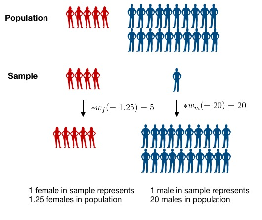

```{r setup, include=FALSE}
knitr::opts_chunk$set(echo = TRUE, message = FALSE, error = TRUE)
knitr::opts_knit$set(root.dir = "/cloud/project")
```

## Module 2: Factors that are associated with development of hypertension

Recall that our main questions of interest are:

  * Question 2.1: What factors measured in the NYC HANES survey are associated with having hypertension?
  * Question 2.2: How do our estimates from survey-weighted logistic regression differ from those where we ignore survey weights?


The data science learning objectives for this module include:

  * Understand the components of a data analysis report
  * Gain experience performing data cleaning, and assessing whether you have been successful
  * Practice selecting data visualizations that fit into the context of your statistical analysis

The statistical learning objectives for this module include:

  * Gain further experience with logistic regression and selecting an appropriate model for your question
  * Understand what a survey-weighted analysis is and how/when we perform one
  * Learn how to select survey weights for unbalanced data

## Reminder: What are the data?

For this case study, we will use data from the [New York City (NYC) Health and Nutrition Examination Survey (NYC HANES)](http://nychanes.org/){target="_blank"}, modeled on the [National Health and Nutrition Examination Survey (NHANES)](https://wwwn.cdc.gov/nchs/nhanes/default.aspx){target="_blank"}. NHANES is a population-based, cross-sectional study with data collected from a physical examination and laboratory tests, as well as a face-to-face interview and an audio computer-assisted self-interview (ACASI). It is designed to assess the health and nutritional status of adults and children in the United States. NYC HANES is a local version of NHANES, which implies it mainly focuses on the New York area. 


## Learning objectives for this week

Our main question of interest for this module is: Based on the data collected from NYC HANES, which risk factors play a role in development of hypertension?

This week, we will continue to work toward answering this by learning how to:

* Discuss our initial data visualizations and how they relate to the question of interest for this module
* Understand why we need to include survey weights in our analysis
* Learn about and see how to use tools designed for working with survey data in R 


## Your data visualizations


### Some points of discussion

In your groups, take 15-20 minutes to discuss the following questions that have come up in our initial examination of the NHANES data set, as it relates to hypertension:


(1) What surprising relationships or patterns did you see in your displays? Were there some counter-intuitive patterns? What might be causing these? How might you investigate this? Find one specific display that shows something unexpected and hypothesize about what could be leading to the unexpected pattern. Devise a plan for investigating whether this is the case.

(2) If anyone chose the income variable, why did you choose the version you did? (Maybe it was just because it was the version used in class.) If you're not sure why I'm asking, take a look back at the [Variable Codebook](https://med.nyu.edu/departments-institutes/population-health/divisions-sections-centers/epidemiology/sites/default/files/nyc-hanes-datasets-and-resources-public-dataset-codebook.pdf){target="_blank"} and see how many different income variables there are.

(3) For each display, can you find one display choice that you would suggest changing to improve the visualization in terms of how it relates to the question of interest? If not, that is OK too!

(4) How would you go about looking for interactions between variables? For example, if you want to see if the difference in hypertension status by race may also be related to income, what plot or table would you make?

(5) There is one variable that I was surprised to see did not show up in any of these visualizations; can you think of what it is?

Start by loading libraries and raw data set.
```{r}
library(tidyverse)  # core group of tidyverse packages
library(knitr)  # to make nice tables
library(ggpubr)
library(ggrepel)
library(tidyverse)
library(kableExtra)
library(survey)
library(haven)
library(broom)
library(plotrix)

dat <- read_sas('module_2/data/d.sas7bdat')
dim(dat)
```


### Example 1

```{r echo = FALSE}
### select and rename eight variables
rename <- 
  dat %>% 
   select(id = KEY,
           age = SPAGE,
           race = DMQ_14_1,
           gender = GENDER,
           born = US_BORN,
           diet = DBQ_1,
           income = INC20K,
           diabetes = DIQ_1,
           bmi = BMI,
           cholesterol = BPQ_16,
           drink = ALQ_1_UNIT,
           smoking = SMOKER3CAT,
           hypertension = BPQ_2,
           surveyweight = EXAM_WT)

rename <- rename %>% 
          mutate(drink = ifelse(dat$ALQ_1 == 0, 4, drink))


hy_df <- rename %>% mutate(
    race=factor(race, levels=c(100, 110, 120, 140, 180, 250), labels=c('White', 'Black/African American', 'Indian /Alaska Native', 'Pacific Islander', 'Asian', 'Other Race')),
    gender = factor(gender, levels=c(1,2), labels=c('Male', 'Female')),
    born = factor(born, levels = c(1,2), labels = c("US Born", "Non-US Born")),
    diet = factor(diet, levels=c(5:1), labels=c('Poor', 'Fair', 'Good', 'Very good','Excellent')),
    income = factor(income, levels=c(1:6), labels=c('Less than $20,000','$20,000 - $39,999', '$40,000 - $59,999','$60,000 - $79,999', '$80,000 - $99,999','$100,000 or more')),
    diabetes = factor(diabetes, levels=c(2,3, 1), labels=c('No','Prediabetes','Yes')),
    cholesterol = factor(cholesterol, levels=c(2,1), labels=c('Low value','High value')),
    drink = factor(drink, levels=c(4:1), labels=c('Never','Yearly', 'Monthly', 'Weekly')),
    smoking = factor(smoking, levels=c(3:1), labels=c('Never smoker','Former smoker','Current smoker')),
    hypertension = factor(hypertension, levels=c(2,1), labels=c('No','Yes'))
    )

hy_df <- 
  hy_df %>%
  drop_na()


```

```{r}

## BMI boxplot
my_table1 <- hy_df %>% 
        ggplot(aes(x = hypertension, y = bmi)) +
          geom_boxplot() + 
          ggtitle('Distribution of BMI by Hypertension Status') +
          xlab("Hypertension") +
          ylab("BMI")
my_table1


## income bar graph
my_table2 <- hy_df %>%
  count(hypertension, income) %>%
  group_by(income) %>%
  mutate(prop = round(n/sum(n), 3))

my_table2 %>%
  filter(hypertension == "Yes") %>%
  ggplot() +
  geom_bar(aes(x = income, y = prop, fill = hypertension), stat = "identity", position = "stack") +
  theme(axis.text.x = element_text(angle = 45, size = 8, margin = margin(t = 3))) +
  theme(axis.text.x = element_text(hjust=1)) +
  ggtitle("Distribution of Hypertension Status by Income") +
  theme(title = element_text(size = 10)) +
  xlab("Income") +
  ylab("Proportion of People with Hypertension") +
  geom_text(aes(x = income, y = prop, label = prop), vjust = -0.3,   size = 3) +
  guides(fill = FALSE)


## race bar graph
my_table3 <- hy_df %>%
  count(hypertension, race) %>%
  group_by(race) %>%
  mutate(prop = round(n/sum(n), 3))

my_table3 %>%
  filter(hypertension == "Yes") %>%
  ggplot() +
  geom_bar(aes(x = race, y = prop, fill = hypertension), stat = "identity", position = "stack") +
  theme(axis.text.x = element_text(angle = 45, size = 8, margin = margin(t = 3))) +
  theme(axis.text.x = element_text(hjust=1)) +
  ggtitle("Distribution of Hypertension Status by Race") +
  theme(title = element_text(size = 10)) +
  xlab("Race") +
  ylab("Proportion of People with Hypertension") +
  geom_text(aes(x = race, y = prop, label = prop), vjust = -0.3,   size = 3) +
  guides(fill = FALSE)


## drink bar graph
my_table4 <- hy_df %>%
  count(hypertension, drink) %>%
  group_by(drink) %>%
  mutate(prop = round(n/sum(n), 3))

my_table4 %>%
  filter(hypertension == "Yes") %>%
  ggplot() +
  geom_bar(aes(x = drink, y = prop, fill = hypertension), stat = "identity", position = "stack") +
  ggtitle("Distribution of Hypertension Status by Frequency of Alcohol Consumption") +
  theme(title = element_text(size = 10)) +
  xlab("Frequency of Alcohol Consumption") +
  ylab("Proportion of People with Hypertension") +
  geom_text(aes(x = drink, y = prop, label = prop), vjust = -0.3,   size = 3) +
  guides(fill = FALSE)

```

The first graph shows the distribution of BMI by hypertension status. People with hypertension are more likely to have a higher BMI (with a median BMI around 30), while people without hypertension have a median BMI of around 25. 
The second graph shows the distribution of hypertension between different income levels. 40.3% of people who make less then $20,000 have hypertension, compared to only 18.6% of people who make over $100,000. This graph shows that people with lower incomes are more likely to have hypertension. 
The third graph shows the distribution of hypertension between different races. I was surprised that 62.5% of Pacific Islanders have hypertension. Only 21.2% of white people have hypertension and only 20% of Indian/Alaskan Native have hypertension (the two lowest groups). 
The fourth graph shows the distribution of hypertension status by frequency of alcohol consumption. Surprisingly, 38.9% of people who never drink have hypertension. Additionally, the people who drink weekly have the lowest risk of hypertension (at 19.4%).


### Example 2

```{r echo = FALSE}
rename <- 
  dat %>% 
    select(id = KEY,
           age = SPAGE,
           race = DMQ_14_1,
           gender = GENDER,
           born = US_BORN,
           diet = DBQ_1,
           income = INC20K,
           diabetes = DIQ_1,
           bmi = BMI,
           cholesterol = BPQ_16,
           drink = ALQ_1_UNIT,
           smoking = SMOKER3CAT,
           hypertension = BPQ_2,
           surveyweight = EXAM_WT, 
           depressed = MCQ_9K
           )

rename <- rename %>% 
          mutate(drink = ifelse(dat$ALQ_1 == 0, 4, drink))

rename <- rename %>% mutate(race=factor(race, levels=c(100, 110, 120, 140, 180, 250), 
                      labels=c('White', 'Black/African American', 
                              'Indian /Alaska Native', 
                              'Pacific Islander', 
                              'Asian', 'Other Race')),
                     gender = factor(gender, levels=c(1,2), 
                        labels=c('Male', 'Female')),
                     born = factor(born, levels = c(1,2),
                        labels = c("US Born", "Non-US Born")),
                     diet = factor(diet, levels=c(5:1), 
                      labels=c('Poor', 'Fair', 'Good', 
                               'Very good','Excellent')),
                     income = factor(income, levels=c(1:6), 
                        labels=c('Less than $20,000','$20,000 - $39,999',
                                 '$40,000 - $59,999','$60,000 - $79,999',
                                 '$80,000 - $99,999','$100,000 or more')),
                     diabetes = factor(diabetes, levels=c(2,3, 1), 
                          labels=c('No','Prediabetes','Yes')),
                     cholesterol = factor(cholesterol, levels=c(2,1), 
                             labels=c('Low value','High value')),
                     drink = factor(drink, levels=c(4:1), 
                       labels=c('Never','Yearly', 'Monthly', 'Weekly')),
                     smoking = factor(smoking, levels=c(3:1), 
                         labels=c('Never','Former','Current')),
                     hypertension = factor(hypertension, levels=c(2,1), 
                              labels=c('No','Yes')),
                     depressed = factor(depressed, levels=c(2,1), 
                              labels=c('No','Yes'))
                     )


rename <- rename %>%
  drop_na()
```

```{r}
table1 <- rename %>%
  count(depressed, gender, income, hypertension) %>%
  group_by(depressed, gender, income) %>%
  mutate(prop = n/sum(n)) %>%
  filter(hypertension == "Yes")

table1


### updating my plot

ggplot(data = table1, aes(x = depressed, y = prop, fill=depressed)) + 
  geom_bar(stat = "identity", position = "dodge") +
 facet_grid(gender~income) +
  theme_bw(base_size=9)+
  geom_text(aes(x=depressed, y= prop, label=round(prop, digits=2), vjust=1.5))+
  labs(y= "Proportion of group with Hypertension", x = "Depression Diagnosis", 
       title = "The Likelihood of Developing Hypertension given Depression Satus \n - stratified by Gender and Income")+
  theme(legend.position = "none",
        plot.title = element_text(hjust = 0.5),
        plot.subtitle = element_text(hjust = 0.5)) + 
  theme(axis.text.x = element_text(angle = 90, vjust = 0.5, hjust=1))


```

The graph examines three variables, gender, income, and depression. Specifically, it looks at how depression can influence someone's chance of hypertension if they have been diagnosed with depression. Among males, across all income levels, having depression increases a person's chance of hyptertension. This relationship does not hold for women, however. For example, in the $40-$59K stratum, the chance of hypertension decreases with a depression diagnosis. 

In the $80-$99K stratum, there are two bars missing for males and females who have depression and have been diagnosed with depression. After going through the table below, I found that there simply are not any people who are in the $80-$99K income bracket that have been diagnosed with depression and hypertension. This prevents me from being able to assess if there is an increased change of hypertension for people diagnosed with depression among males and females in the same income stratum. 


### Example 3

```{r echo = FALSE}
rename <- 
  dat %>% 
    select(id = KEY,
           age = SPAGE,
           race = DMQ_14_1,
           gender = GENDER,
           born = US_BORN,
           diet = DBQ_1,
           income = INC20K,
           diabetes = DIQ_1,
           bmi = BMI,
           cholesterol = BPQ_16,
           drink = ALQ_1_UNIT,
           smoking = SMOKER3CAT,
           hypertension = BPQ_2,
           surveyweight = EXAM_WT)

hy_df <- rename %>% mutate(race=factor(race, levels=c(100, 110, 120, 140, 180, 250), 
                      labels=c('White', 'Black/African American', 
                              'Indian /Alaska Native', 
                              'Pacific Islander', 
                              'Asian', 'Other Race')),
                     gender = factor(gender, levels=c(1,2), 
                        labels=c('Male', 'Female')),
                     born = factor(born, levels = c(1,2),
                        labels = c("US Born", "Non-US Born")),
                     diet = factor(diet, levels=c(5:1), 
                      labels=c('Poor', 'Fair', 'Good', 
                               'Very good','Excellent')),
                     income = factor(income, levels=c(1:6), 
                        labels=c('Less than $20,000','$20,000 - $39,999',
                                 '$40,000 - $59,999','$60,000 - $79,999',
                                 '$80,000 - $99,999','$100,000 or more')),
                     diabetes = factor(diabetes, levels=c(2,1,3), 
                          labels=c('No','Yes','Prediabetes')),
                     cholesterol = factor(cholesterol, levels=c(2,1), 
                             labels=c('Low value','High value')),
                     drink = factor(drink, levels=c(1,2,3), 
                       labels=c('Weekly', 'Monthly', 'Yearly')),
                     smoking = factor(smoking, levels=c(3:1), 
                         labels=c('Never smoker','Former smoker','Current smoker')),
                     hypertension = factor(hypertension, levels=c(2,1), 
                              labels=c('No','Yes'))
                     )
dat$drink <- ifelse(dat$ALQ_1 == 0, 4, ifelse(dat$ALQ_1 %in% c(1, 2, 3), dat$ALQ_1, NA))

#dropping NA
hy_p_df <- 
  hy_df %>%
  drop_na()
```

```{r, fig.width= 15}
p1 <- hy_p_df %>% 
        ggplot(aes(x = hypertension, y = age)) +
          geom_boxplot() + 
          ggtitle('Distribution of age by hypertension status')
p2 <- hy_p_df %>% 
        ggplot(aes(x = gender, fill = hypertension)) + 
          geom_bar(position = "fill") + 
          ggtitle('Proportion of hypertension') + 
          ylab('proportion') + theme(axis.text.x = element_text(angle = 90, vjust = 0.5, hjust=1))

p3 <- hy_p_df %>% 
        ggplot(aes(x = income, fill = hypertension)) + 
          geom_bar(position = "fill") + 
          ggtitle('Proportion of hypertension') + 
          ylab('proportion') + theme(axis.text.x = element_text(angle = 90, vjust = 0.5, hjust=1))
ggarrange(p1, p2, p3, ncol=3, nrow=1)
```

The first panel displays box plots suggesting that individuals with hypertension tend to be older compared to those without hypertension. The second panel illustrates that a higher proportion of males tend to have hypertension compared to females. The last indicates that hypertension prevalence varies across income groups and has a higher prevalence among lower income brackets.

### Example 4

```{r echo= FALSE}
### Renaming column names for data subset of interest
rename <-  dat %>% 
    select(id = KEY,
           age = SPAGE,
           race = DMQ_14_1,
           gender = GENDER,
           born = US_BORN,
           diet = DBQ_1,
           income = INC20K,
           diabetes = DIQ_1,
           bmi = BMI,
           cholesterol = BPQ_16,
           drink = ALQ_1_UNIT,
           smoking = SMOKER3CAT,
           hypertension = BPQ_2,
           surveyweight = EXAM_WT)
summary(rename)

##

rename <- rename %>% 
          mutate(drink = ifelse(dat$ALQ_1 == 0, 4, drink))

##

hy_df <- rename %>% 
  mutate(
    
    race=factor(race, levels=c(100, 110, 120, 140, 180, 250), labels=c('White', 'Black/African American', 'Indian /Alaska Native', 'Pacific Islander', 'Asian', 'Other Race')),
    
    gender = factor(gender, levels=c(1,2), labels=c('Male', 'Female')),
    
    born = factor(born, levels = c(1,2), labels = c("US Born", "Non-US Born")),
    
    diet = factor(diet, levels=c(5:1), labels=c('Poor', 'Fair', 'Good', 
                               'Very good','Excellent')),
    
    income = factor(income, levels=c(1:6), labels=c('Less than $20,000','$20,000 - $39,999',
                                 '$40,000 - $59,999','$60,000 - $79,999',
                                 '$80,000 - $99,999','$100,000 or more')),
    
    diabetes = factor(diabetes, levels=c(2,1,3), labels=c('No','Yes','Prediabetes')),
    
    cholesterol = factor(cholesterol, levels=c(2,1), labels=c('Low value','High value')),
    
    drink = factor(drink, levels=c(1,2,3), labels=c('Weekly', 'Monthly', 'Yearly')),
    
    smoking = factor(smoking, levels=c(3:1), labels=c('Never smoker','Former smoker','Current smoker')),
    
    hypertension = factor(hypertension, levels=c(2,1), labels=c('No','Yes'))
                     )

hy_p_df <- 
  hy_df %>%
  drop_na()


```

```{r}
my_table <- hy_p_df %>%
  count(gender, hypertension, income) %>%
  group_by(gender, income) %>%
  mutate(prop = n/sum(n), 
         percent = round(prop*100, digits = 2))


## 
my_table %>%

filter(hypertension == "Yes") %>%
  
ggplot() +
  
  geom_bar(aes(x = gender, y = prop, fill = hypertension), stat = "identity", position = "dodge", fill = "coral3") + 
  
  
  labs(title = "Risk of Hypertension comparing Males to Females", subtitle = "Stratified by Income", x = "Gender", y = "Proportion of Hypertension") +
  
  theme_bw() +
  
  facet_wrap(~income) +
    theme(strip.text = element_text(size = 8, color = "black", family = "Times New Roman")) +
  
  theme(
    plot.title = element_text(color = "black", size = 12, family = "Times New Roman", face = "bold"),
    plot.subtitle = element_text(color = "darkslategray", size = 10, family = "Times New Roman", face = "italic"),
    axis.title = element_text(color = "black", size = 12, family = "Times New Roman", face = "bold"),
    axis.text =  element_text(color = "black", size = 8, family = "Times New Roman"))


g2 <- hy_p_df %>% 
  

  
        ggplot(aes(x = hypertension, y = age)) +
          geom_boxplot() + 
          labs(title = "Distribution of Age for People with Hypertension",subtitle = "Stratified by Gender",  x = "Hypertension", y = "Age") +
  
  theme_bw() +
  
  facet_wrap(~gender) +
    theme(strip.text = element_text(size = 8, color = "black", family = "Times New Roman")) +
  
  theme(
    plot.title = element_text(color = "black", size = 12, family = "Times New Roman", face = "bold"),
    plot.subtitle = element_text(color = "darkslategray", size = 10, family = "Times New Roman", face = "italic"),
    axis.title = element_text(color = "black", size = 12, family = "Times New Roman", face = "bold"),
    axis.text =  element_text(color = "black", size = 8, family = "Times New Roman"))
  
g2

```

My first display is showing the risk of hypertension comparing males to females. The display stratifies the risk of having disease by income level. The relationship displayed shows that your risk for hypertension is generally much higher if you are a female earning less that $20,000. 

My boxplot is showing that females with hypertension tend to be older than males with hypertension. The boxplot also shows that in both males and females those with hypertension tend to be older than the males and females who do not have hypertension. 


### Example 5

```{r echo = FALSE}
rename <- 
  dat %>% 
    select(id = KEY,
           diabetes = DIQ_1,
           bmi = BMI,
           cholesterol = BPQ_16,
           drink = ALQ_1_UNIT,
           smoking = SMOKER3CAT,
           hypertension = BPQ_2,
           )

rename <- rename %>% 
          mutate(drink = ifelse(dat$ALQ_1 == 0, 4, drink))


rename_recoded <- rename%>% 
  mutate(
  diabetes = factor(diabetes, levels=c(2,3, 1), labels=c('No','Prediabetes','Yes')),
  cholesterol = factor(cholesterol, levels=c(2,1), 
labels=c('Low value','High value')),
  drink = factor(drink, levels=c(4:1), 
labels=c('Never','Yearly', 'Monthly', 'Weekly')),
  hypertension = factor(hypertension, levels=c(2,1), 
labels=c('No','Yes'))
                     )%>%
  drop_na()
  


```

```{r}
### put code to create data display here

mytable_diab <- rename_recoded %>%
  count(hypertension,diabetes) %>%
  group_by(diabetes) %>%
  mutate(N = sum(n))%>%
  mutate(prop = n/sum(n))%>%
  ungroup()%>%
  group_by(hypertension)%>%
  mutate(rr = prop/prop[diabetes == "No"])


mytable_chol <- rename_recoded %>%
  count(hypertension,cholesterol) %>%
  group_by(cholesterol) %>%
  mutate(N = sum(n))%>%
  mutate(prop2 = n/sum(n))%>%
  ungroup()%>%
  group_by(hypertension)%>%
  mutate(rr2 = ifelse(cholesterol == "High value",prop2/prop2[cholesterol == "Low value"],prop2/prop2[cholesterol == "High value"]))

mytable_drink <- rename_recoded %>%
  count(hypertension,drink) %>%
  group_by(drink) %>%
  mutate(N = sum(n))%>%
  mutate(prop3 = n/sum(n))%>%
  ungroup()%>%
  group_by(hypertension)%>%
  mutate(rr3 = prop3/prop3[drink == "Never"])

p_diab <- mytable_diab%>%
  filter(hypertension == "Yes", diabetes != "No")%>%
  ggplot(aes(x = diabetes, y = rr))+
  geom_bar(stat = "identity", fill = 'red')+
  labs(y= "Relative Risk of Hypertension", x= "Diabetes Status", title = "Relative Risk of Hypertension based on Diabetes Status", subtitle = "Compared with a basleine of No Diabetes") + 
  theme_bw()+
  theme(plot.title = element_text(hjust=0.5,face="bold", size = 8),
        plot.subtitle = element_text(hjust = 0.5,face="italic", size = 8))

p_chol <- mytable_chol%>%
  filter(hypertension == "Yes")%>%
  ggplot(aes(x = cholesterol, y = rr2))+
  geom_bar(stat = "identity", fill = 'darkgreen')+
  labs(y= "Relative Risk of Hypertension", x= "Cholesterol Level", title = "Relative Risk of Hypertension based on Cholesterol Levels") + 
  theme_bw()+
  theme(plot.title = element_text(hjust=0.5,face="bold", size = 8),
        plot.subtitle = element_text(hjust = 0.5,face="italic", size = 8))


p_drink <- mytable_drink%>%
  filter(hypertension == "Yes", drink != "Never")%>%
  ggplot(aes(x = drink, y = rr3))+
  geom_bar(stat = "identity", fill = 'blue')+
  labs(y= "Relative Risk of Hypertension", x= "Drinking Frequency", title = "Relative Risk of Hypertension based on Drinking Frequency", subtitle = "Compared with a basleine of Never Drinker, frequency from the last 12 months") + 
  theme_bw()+
  theme(plot.title = element_text(hjust=0.5,face="bold", size = 7),
        plot.subtitle = element_text(hjust = 0.5,face="italic", size = 7))


ggarrange(p_diab, p_chol, p_drink, hjust = 1, vjust = 1)
```

I looked at the association between hypertension and diabetes, cholesterol, and drinking respectively. The highest association was with diabetes and hypertension as the relative risk of having hypertension for someone with diabetes is `r mytable_diab %>% filter(diabetes == "Yes" & hypertension == "Yes") %>%select("rr") %>% pull() %>% format(digits = 3)` times higher than someone without diabetes! A similar association exists with cholesterol level as well. The relative risk of hypertension for someone with a high cholesterol level is `r mytable_chol %>% filter(cholesterol == "High value" & hypertension == "Yes")%>%  select("rr2") %>% pull() %>% format(digits = 3)` times higher than someone with low cholesterol levels. I was surprised to see a decline in relative risk as there was an increase in the frequency of drinking compared to a never drinker.

### Example 6

```{r echo = FALSE}
# select variables of interest   
rename <- 
  dat %>% 
    select(id = KEY,
           age = SPAGE,
           race = DMQ_14_1,
           gender = GENDER,
           born = US_BORN,
           diet = DBQ_1,
           income = INC20K,
           diabetes = DIQ_1,
           bmi = BMI,
           cholesterol = BPQ_16,
           drink = ALQ_1_UNIT,
           smoking = SMOKER3CAT,
           hypertension = BPQ_2,
           surveyweight = EXAM_WT)

rename <- rename %>% 
          mutate(drink = ifelse(dat$ALQ_1 == 0, 4, drink))

hy_df <- rename %>% mutate(race=factor(race, levels=c(100, 110, 120, 140, 180, 250), 
                      labels=c('White', 'Black/African American', 
                              'Indian /Alaska Native', 
                              'Pacific Islander', 
                              'Asian', 'Other Race')),
                     gender = factor(gender, levels=c(1,2), 
                        labels=c('Male', 'Female')),
                     born = factor(born, levels = c(1,2),
                        labels = c("US Born", "Non-US Born")),
                     diet = factor(diet, levels=c(5:1), 
                      labels=c('Poor', 'Fair', 'Good', 
                               'Very good','Excellent')),
                     income = factor(income, levels=c(1:6), 
                        labels=c('Less than $20,000','$20,000 - $39,999',
                                 '$40,000 - $59,999','$60,000 - $79,999',
                                 '$80,000 - $99,999','$100,000 or more')),
                     diabetes = factor(diabetes, levels=c(2,1,3), 
                          labels=c('No','Yes','Prediabetes')),
                     cholesterol = factor(cholesterol, levels=c(2,1), 
                             labels=c('Low value','High value')),
                     drink = factor(drink, levels=c(4:1), 
                       labels=c('Never','Yearly', 'Monthly', 'Weekly')),
                     smoking = factor(smoking, levels=c(3:1), 
                         labels=c('Never smoker','Former smoker','Current smoker')),
                     hypertension = factor(hypertension, levels=c(2,1), 
                              labels=c('No','Yes'))
                     )

hy_p_df <- 
  hy_df %>%
  drop_na()


```

```{r}
### put code to create data display here

my_table <- hy_p_df %>%
  count(diabetes, hypertension) %>%
  group_by(diabetes) %>%
  mutate(prop = n/sum(n))

p1 <- my_table %>%
  filter(hypertension == "Yes") %>%
  ggplot() + 
  geom_bar(aes(x = diabetes, y = prop), stat = "identity", position = "stack") +
  theme_bw(base_size=8.5) +
  ylim(0, 0.7) +
  geom_text(aes(x = diabetes, y = prop, label = round(prop, digits=2), vjust=-0.3))+
  labs(title = "Distribution of Hypertension",
       subtitle = "By Diabetes Status",
       x = "Diabetes Status",
       y = "Proportion with Hypertension")

#my_table_2 <- hy_p_df %>%
 # count(gender, hypertension) %>%
  #group_by(gender) %>%
  #mutate(prop = n/sum(n))

#p2 <- my_table_2 %>%
  #filter(hypertension == "Yes") %>%
  #ggplot() + 
  #geom_bar(aes(x = gender, y = prop), stat = "identity", position = "stack") +
  #theme_bw(base_size=8.5) +
  #ylim(0, 0.4) +
  #geom_text(aes(x = gender, y = prop, label = round(prop, digits=2), vjust=-0.3))+
  #labs(title = "Distribution of Hypertension",
   #    subtitle = "By Sex",
    #   x = "Hypterension Status",
     #  y = "Proportion with Hypertension")

my_table_3 <- hy_p_df %>%
  count(cholesterol, hypertension) %>%
  group_by(cholesterol) %>%
  mutate(prop = n/sum(n))


p3 <- my_table_3 %>%
  filter(hypertension == "Yes") %>%
  ggplot() + 
  geom_bar(aes(x = cholesterol, y = prop), stat = "identity", position = "stack") +
  theme_bw(base_size=8.5) +
  ylim(0, 0.5) +
  geom_text(aes(x = cholesterol, y = prop, label = round(prop, digits=2), vjust=-0.3))+
  labs(title = "Distribution of Hypertension",
       subtitle = "By Cholesterol Level",
       x = "Colesterol Level",
       y = "Proportion with Hypertension")

my_table_4 <- hy_p_df %>%
  count(drink, hypertension) %>%
  group_by(drink) %>%
  mutate(prop = n/sum(n))


p4 <- my_table_4 %>%
  filter(hypertension == "Yes") %>%
  ggplot() + 
  geom_bar(aes(x = drink, y = prop), stat = "identity", position = "stack") +
  theme_bw(base_size=8.5) +
  ylim(0, 0.5) +
  geom_text(aes(x = drink, y = prop, label = round(prop, digits=2), vjust=-0.3))+
  labs(title = "Distribution of Hypertension",
       subtitle = "By Drinking Frequency",
       x = "Drinking Frequency",
       y = "Proportion with Hypertension")

ggarrange(p1, p3, p4, ncol=2, nrow=2)


```

My three data displays show the relationship between different factors and hypertension. The first graph displays the association between diabetes status and hypertension, indicating that having diabetes increases the risk of hypertension (NoDiabetes = 22% vs. YesDiabetes = 64%). The second graph displays the association between cholesterol level and hypertension, indicating that high cholesterol increases the risk of hypertension (LowValue = 19% vs. HighValue = 47%). The last graph displays the association between drinking frequency and hypertension, indicating that increased drinking frequency tends to decrease the risk of hypertension. I am surprised by this relationship because I thought that increased drinking frequency would increase the risk of hypertension. 


<details> <summary> A few thoughts for when we return from our groups </summary>


* *IMPORTANT*: You may have noticed something unintuitive about smoking status and hypertension risk. There was a mistake in my code from a previous lecture for how I recoded the `SMOKER3CAT` variable. It has been corrected below to match what is in the [Variable Codebook](https://med.nyu.edu/departments-institutes/population-health/divisions-sections-centers/epidemiology/sites/default/files/nyc-hanes-datasets-and-resources-public-dataset-codebook.pdf){target="_blank"}. Yi or I will also include a modification to the code in your assignments when we grade them this week, although not many of you are currently using this variable for your visualizations. But if you do use it in the future, you'll want to make sure it is coded correctly!
* The hypertension legend does not need to be displayed on each panel of multi-panel figures. In fact, it does not need to be displayed at all if you only plot risk of hypertension (and not also risk of no-hypertension).
* When plotting multi-panel figures, you may need to specify the figure width in the code chunk header to avoid the plots looking compressed. See Example 3 for an example of how to do this.
* Something to think about for people interested in race or socio-economic status: Age/income/education are all associated with socio-economic status, as is race. You'll want to think about which variables to include to examine the particular relationship you are interested in.

Some limitations/points for discussion regarding race and sex: both are extremely commonly used in epidemiological studies, like the one we are discussing here. Both have limitations in how they are measured and how they are used and understood in a data analysis. We should always strive to do our best in discussing and working with these variables. For example, in our case studies, we include a statement like:

> Note: While gender and sex are not actually binary, the data used in this analysis unfortunately only contains information for groups of individuals who self-reported as male or female. We also acknowledge that unfortunately not all ethnicities or group intersections are represented in the data. More research should be devoted to collecting data about the health of additional groups of people.

Some references about race in biomedical research:

[Examining How Race, Ethnicity, and Ancestry Data Are Used In Biomedical Research](https://www.ncbi.nlm.nih.gov/pmc/articles/PMC6640836/){target="_blank"}

[Race and health page from Wikipedia](https://en.wikipedia.org/wiki/Race_and_health){target="_blank"}


</details>

## Data analysis concerns: model framework and survey weights

Now that we have spent some time cleaning the data and looking at data visualizations, we want to use a statistical model to address our question of interest about which factors are related to the risk of hypertension.

Which model should we use? Since we are looking at whether or not someone develops hypertension, our outcome variable (`hypertension`) is **binary**. A binary outcome means a logistic regression model is a natural choice.  However, think of the nature of our dataset and how it was collected. It is data obtained from a survey, and we have to account for this during the analysis of the data.

In a survey sample, we often end up with "too many" samples in a category, often due to the designed sampling plan.  By "too many", we mean more than would be expected based on the make-up of the population from which we are sampling.  For example, we may have a much higher proportion of women in our sample compared to the population and a much lower proportion of men than in the population. This may happen by design if we purposefully *oversample* a group that isn't well represented in the overall population. Why might we want to do this?

To analyze our survey data and infer back to the population, we can use data weighting to account for the mismatch between the population and sample. If we want the data to reflect the whole population, instead of treating each data point equally, we weight the data so that taken together, our sample does reflect the entire community.

To appropriately analyze our data as a survey, we will use the [package `survey`](https://cran.r-project.org/web/packages/survey/survey.pdf){target="_blank"}, which contains functions for various types of analysis that account for survey design.

## Survey weights 

### What are survey weights?

Suppose that we have 25 students (20 male and 5 female) in our biostatistics class, and we want to talk with 5 of them to gauge their understanding of the content in the class. Although the proportion of female students in the population is small, we are very interested in getting their opinion, so we want to be sure to have some female students in our sample.  By randomly sampling 5 students from the class, it's quite possible we could end up with all male students in our sample, and we wouldn't learn anything about the female perspective in the class. 

Consider the extreme case where we are going to require that 4 of the 5 people we sample are female students, to be sure we get good information about the female perspective.  We sample 4 of the 5 female students and 1 of the 20 male students.   Do we expect this sample to represent the population? Definitely not, since there is a higher proportion of females in the sample than the population. We can correct for this by weighting our samples so that, taken together, they better reflect the composition of the population we want to learn about. 

Let's assume we sampled 4 of the 5 female students and 1 of the 20 male students from our population. Who do you think should get a higher weight in our analysis, males or females? What is your reasoning?


To calculate the survey weights, we could use the following formula:

$$
\begin{aligned}
Weight & = \frac{1}{Prob~of~being~selected~for~sample} \\
       & = \frac{1}{(Number~in~sample)/(Number~in~population)} \\
       & \\
       & =  \frac{Number~in~population}{Number~in~sample}
\end{aligned}
$$

That gives the following sample weights:

$$w_m=Male~Weight = \frac{20}{1} = 20$$

$$w_f=Female~Weight = \frac{5}{4} = 1.25$$

We can interpret these weights by saying that each male student in the sample represents 20 male students in the population and each female student in the sample represents 1.25 female students in the population.  Mathematically, we can see this as:

$$ 1~observed~male* w_m = 20~males $$ 
and 
$$ 4~observed~females * w_f = 5~females$$ 

<center>

</center>

By weighting the observations, we make the sample better represent the population.

For complex survey sampling designs, it can be complicated to calculate the weight for each individual observation. However, for many large survey data sets, such as NHANES, the appropriate weight is calculated by the organization that administers the survey and provided as a variable in the dataset. In our case study, this survey weight is calculated and provided as the `surveyweight` variable and we can simply apply this weight and perform a **survey-weighted logistic regression**.

### Selecting the weights

Because the NYC HANES 2013-2014 data have been collected to address a variety of different questions and using different surveys, the researchers who produced the data have employed a somewhat complex weighting scheme to compensate for unequal probability of selection. Five sets of survey weights have been constructed to correspond to different sets of variables that were collected: CAPI  weight, Physical weight, Blood Lab result weight, Urine Lab results weight and Saliva Lab results weight. **The determination of the most appropriate weight to use for a specific analysis depends upon the variables selected by the data analyst**. 

We will give a table to indicate each variable's origin stream:


| Variable names   |      Component      |
|---------------------------------|---------------------------------|
| age                                   | CAPI                                                                                                                                                                 |
| race                                  | CAPI                                                                                                                                                                 |
| gender                                | CAPI                                                                                                                                                                 |
| diet                                  | CAPI                                                                                                                                                                 |
| income                                | CAPI                                                                                                                                                                 |
| diabetes                               | CAPI                                                                                                                                                               |
| cholesterol                           | CAPI                                                                                                                                                                 |
| drink                                 | CAPI                                                                                                                                                                 |
| smoking                               | CAPI                                                                                                                                                                 |
| hypertension                           | CAPI                                                                                                                                                                |
| bmi                                    | EXAM                                                                                                                                                                |


When an analysis involves variables from different components of the survey, the analyst should decide whether the outcome is inclusive or exclusive, and then choose certain weights. To learn how to use weights for different purposes, refer to the particular [Analytics Guidelines](https://med.nyu.edu/departments-institutes/population-health/divisions-sections-centers/epidemiology/sites/default/files/nyc-hanes-datasets-and-resources-analytics-guidelines.pdf){target="_blank"} for the survey. 

In our case, we choose EXAM weight since our analysis is exclusive, i.e., we plan to restrict the samples included to those who have all of the data we are interested in looking at. Since one of the variables we are looking at is bmi, our dataset is limited to those who received a physical exam test, which means all of our survey participants have a value for the `EXAM_WT` variable. We selected this variable and renamed it as `surveyweight` in the earlier data cleaning part of this analysis. 

## Finite population correction factor

There is one more technical detail that we need to consider when using survey data. Many methods for analysis of survey data make the assumption that **samples were collected using sampling with replacement**, i.e., any time a new participant is drawn, each member in the population has an equal chance of being sampled, even if they have already been sampled. This is not usually how surveys are actually carried out, so an adjustment may be necessary to reflect this difference. This adjustment is called the **finite population correction factor** and it is defined as:

$$FPC = (\frac{N-n}{N-1})^{\frac{1}{2}}$$
 
* `N` = population size
* `n` = sample size

In the case when the assumption above is violated (e.g. if you are sampling a sufficiently large proportion of the population), then you might sample the same person twice. The finite population correction (FPC) is used to reduce the variance when a substantial fraction of the total population of interest has been sampled. We can find the value of `N` and `n` for our survey from the [Analytics Guidelines](https://med.nyu.edu/departments-institutes/population-health/divisions-sections-centers/epidemiology/sites/default/files/nyc-hanes-datasets-and-resources-analytics-guidelines.pdf){target="_blank"}. Next let's calculate the FPC as below:

```{r}
N <-  6825749
n <- nrow(dat)
((N-n)/(N-1))^0.5
```

The FPC of our data set is very close to 1 since our sample is quite small compared to the size of the population, and we could simply ignore the FPC. But technically, since the data were collected through sampling without replacement, it is more appropriate to use it.


## Incorporating survey weights into our analysis

We will read in and recode the data, as we did last week. NOTE: We can't remove ANY data points from our set of data this time because we will be using survey weights. We will discuss how to address this below.

```{r read-data}
rename <- 
  dat %>% 
    select(id = KEY,
           age = SPAGE,
           race = DMQ_14_1,
           gender = GENDER,
           born = US_BORN,
           diet = DBQ_1,
           income = INC20K,
           diabetes = DIQ_1,
           bmi = BMI,
           cholesterol = BPQ_16,
           drink = ALQ_1_UNIT,
           smoking = SMOKER3CAT,
           hypertension = BPQ_2,
           surveyweight = EXAM_WT)

rename <- rename %>% 
          mutate(drink = ifelse(dat$ALQ_1 == 0, 4, drink))

hy_df <- rename %>% mutate(race=factor(race, levels=c(100, 110, 120, 140, 180, 250), 
                      labels=c('White', 'Black/African American', 
                              'Indian /Alaska Native', 
                              'Pacific Islander', 
                              'Asian', 'Other Race')),
                     gender = factor(gender, levels=c(1,2), 
                        labels=c('Male', 'Female')),
                     born = factor(born, levels = c(1,2),
                        labels = c("US Born", "Non-US Born")),
                     diet = factor(diet, levels=c(5:1), 
                      labels=c('Poor', 'Fair', 'Good', 
                               'Very good','Excellent')),
                     income = factor(income, levels=c(1:6), 
                        labels=c('Less than $20,000','$20,000 - $39,999',
                                 '$40,000 - $59,999','$60,000 - $79,999',
                                 '$80,000 - $99,999','$100,000 or more')),
                     diabetes = factor(diabetes, levels=c(2,3, 1), 
                          labels=c('No','Prediabetes','Yes')),
                     cholesterol = factor(cholesterol, levels=c(2,1), 
                             labels=c('Low value','High value')),
                     drink = factor(drink, levels=c(4:1), 
                       labels=c('Never','Yearly', 'Monthly', 'Weekly')),
                     smoking = factor(smoking, levels=c(1,3,2), 
                         labels=c('Never smoker','Former smoker','Current smoker')),
                     hypertension = factor(hypertension, levels=c(2,1), 
                              labels=c('No','Yes'))
                     )


## we will not use this in our survey design object, but will use it for comparisons below
hy_p_df <-
  hy_df %>%
  drop_na()

```

## Specify the survey design

We now need to figure out how to specify the survey design and incorporate the sampling weights in our modeling steps. To help us do this, we use the function `svydesign()` in the [package `survey`](https://cran.r-project.org/web/packages/survey/survey.pdf). This function combines a data frame and all the design information needed to specify a survey design. Here is the list of options provided in this function:

* `ids`: Formula used to specify the cluster sampling design. *Cluster sampling* is a multi-stage sampling design where the total population is divided into several clusters and a simple random sample of clusters is selected. Then a sample is taken from the elements of each selected cluster. Use `~0` or `~1` as the formula when there are no clusters.

* `data`: Data frame (or database table name) containing the variables for analysis look up variables in the formula arguments.

* `weights`: Formula or vector specifying the sampling weights. 

* `fpc`: Finite population correction, `~rep(N,n)`  generates a vector of length n where each entry is N (the population size). Default value is 1. The use of fpc indicates a sample without replacement, otherwise the default is a sample with replacement. Since our finite-population correction factor is very close to 1, we omit this argument, i.e., let it take the default value.
 
* `strata`: Specification for stratified sampling.  *Stratified sampling* is a sampling design which divides members of the population into homogeneous subgroups and then samples independently in these subpopulations. It is advantageous when subpopulations within an overall population vary.
 
In our situation, we don't have any clusters or stratified sampling to specify, we just need to include the appropriate survey weights provided with the data.  We will not include a FPC, since our FPC was approximately 1.
 
Here's how we specify the design relative to our dataset, `hy_df`:

```{r}
hypertension_design <- svydesign(
  id = ~1,
  weights = ~hy_df$surveyweight,
  data = hy_df
)
```


The arguments are interpreted as the following:

* `ids = ~1` means there is no cluster sampling
* `data = hy_df` tells `svydesign` where to find the variables for analysis
* `weights= ~hy_df$surveyweight` tells it where to find the weight in our data frame

We can use `summary()` to show the results:
```{r}
summary(hypertension_design)
```

"Independent sampling design" means our sampling design is a simple random sample (SRS). By setting other parameters it is possible to specify different kinds of designs, such as stratified sampling, cluster sampling, or other multi-stage designs.


## Calculate survey-weighted summary statistics

Once we have created our `svydesign` object, we can use the convenient `svy*` functions to calculate summary statistics that account for survey design features.

First, we want to create a clean data set, where we no longer have observations with missing data. We will do this using the `subset` function since the `drop_na()` function does not work on the output of the `svydesign` function, but the `subset` function does. We can use the `complete.cases` function to identify which individuals in our `hy_df` data frame are not missing any of the variables.

```{r}
h_design_nona <- subset(hypertension_design, complete.cases(hy_df))

dim(hypertension_design)
dim(h_design_nona)
```


To calculate the mean and its standard error, use the function `svymean()`. The `svymean()` function calculates a weighted estimate for the mean by weighting each observation with its sampling weight. We can compare this result to ignoring the survey weights using the `mean()` and `std.error()` functions in base R.

Here we look at both the weighted and un-weighted mean BMI:

```{r}
svymean(~bmi, h_design_nona)
```

```{r}
mean(hy_p_df$bmi)
std.error(hy_p_df$bmi)
```

There is not a very large difference between these two values and their standard errors.  However, the survey-weighted results are "better" because they account for the sampling design of the HANES NYC survey.

To calculate a survey-weighted confidence interval for mean BMI value, we use the function `confint()` directly on the `svymean()` function:

```{r}
confint(svymean(~bmi, h_design_nona))
```

Statistics for subgroups are also easy to calculate with the function `svyby()`.  Here we look at mean BMI within groups defined by diet quality.
```{r}
svyby(~bmi, by=~diet, design = h_design_nona, 
      FUN = svymean)
```

If we are particularly interested in one subgroup of individuals, we can use the `subset()` to define a design for our subgroup of interest.  For example, if we are only interested in learning about the female population:
```{r}
h_design_female <- subset(h_design_nona,gender=="Female")
svymean(~bmi, h_design_female)
```

We estimate that the mean BMI for females in the population is 28.

Note that if we are limiting our analysis to a subgroup of the data, we **must** use the subset command to define a new survey design that relates to this new subpopulation.  This is because the survey weights need to be updated to reflect how the data represents this new population.  The `subset` command will appropriately update the survey weights so the analysis reflects the survey design of the subsetted data.  We **cannot** simply use a subset of the data with the original survey design. This is why we needed to start with the complete data set, not the one where we had already removed individuals with missing data.

How would we compare our mean and SE of bmi for the weighted and unweighted data?

## Assignment 2.2

Refine your data display from last week with the NYC HANES data to answer Question 2.1: What factors measured in the NYC HANES survey are associated with having hypertension? (Can do now.)

Use the `svydesign()` function to create an appropriate survey-weighted data set to use for your modeling analysis. You will need to be sure to include a variable with the appropriate survey weights in your data set. (Can do now.)

Use the `svyglm()` function to fit a logistic regression model, with hypertension as the outcome, to begin to explore the relationships among the variables in your data set in a modeling framework. You may want to consider the variables you include based on your data visualizations or other reasons. Write a few sentences interpreting the outputs of your model. (If you included many variables, you don't need to write about all of them here.) (Can do after Wednesday's class.)

* Submit your data display and the code for your initial survey-weighted analysis in R Markdown through Github by Sunday (March 3, 2024) at midnight.
* Post a screenshot of your revised data display (just the graph or table) and/or a summary table of your model results on Piazza in the "Assignment 2-2 Results" thread.  Add a sentence or two that describes what you have found so far.  You are welcome to post this anonymously to your classmates. You can also include comments about what your chose to do or questions you had as you were making the display and fitting your model.
* You may work together on this assignment, but you must submit your own data display; please credit in your assignment anyone with whom you collaborated.
* Next week in class we will continue with discussion/critiques of your displays and brainstorm as a class on ideas to improve these displays, discuss the intial outputs of your survey-weighted logistic regression, and start talking about variable selection.

## Bonus content for Module 2

Throughout our courses, we use case-study style analyses to present data science and statistics concepts in the context of public health questions and data collected from real life. For the past couple of years, we have been involved in developing teaching materials in this style as part of the [Open Case Studies](https://www.opencasestudies.org){target="_blank"} project. These case studies are full of useful examples of obtaining data from varied sources, from websites, to pdfs to twitter feeds. They also present steps to create useful and intricate data visualizations as well as in-depth presentations of statistical methods. As you seek inspiration for your own projects later in the course, or aim to expand your own data science skills, you might find them to be a useful resource. We especially recommend the interface [here](https://americanhealth.jhu.edu/open-case-studies){target="_blank"} which provides additional tools for navigating among ten of the case studies. 

One great aspect of these case studies is that all the code is provided for creating some amazing multi-panel data visualizations. In addition to `ggarrange` which we have shown you (and which you can learn more about [here](https://rpkgs.datanovia.com/ggpubr/reference/ggarrange.html){target="_blank"}), the case studies use the `patchwork` package (see [here](https://patchwork.data-imaginist.com){target="_blank"}) as well as `cowplot` (see [here](https://wilkelab.org/cowplot/index.html){target="_blank"}). 